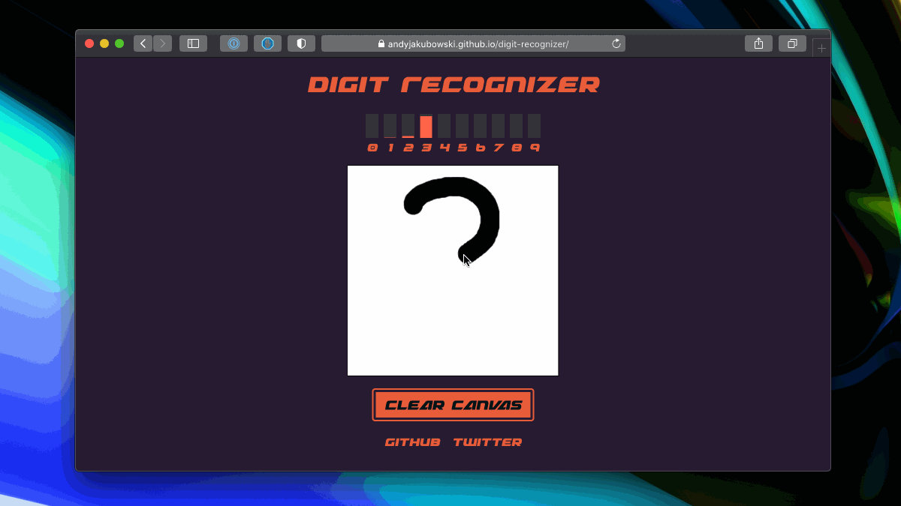
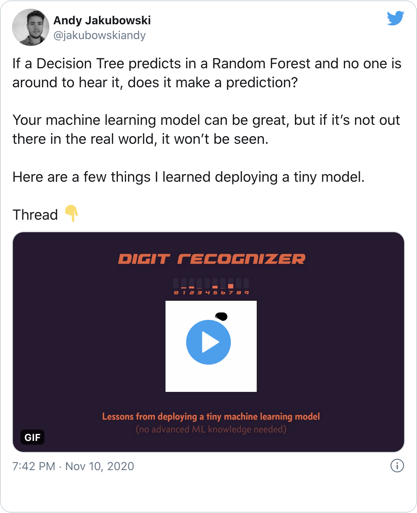

# Digit Recognizer

A convolutional neural network pre-trained for handwritten digit recognition, running in the browser via ONNX.js.

## Try it out

[https://andyjakubowski.github.io/digit-recognizer/](https://andyjakubowski.github.io/digit-recognizer/)

## Folder structure

`dist` is the demo website that runs the model.

`notebooks` holds my own [scikit-learn](https://scikit-learn.org) model that I initially trained, but couldn’t deploy. It also includes the pre-trained model I downloaded from the [ONNX Model Zoo](https://github.com/onnx/models).

## Twitter thread

The goal of this project was to deploy a working machine learning model in five days. I described the details, and my learnings, in this [Twitter thread](https://twitter.com/jakubowskiandy/status/1326233668000641024).

